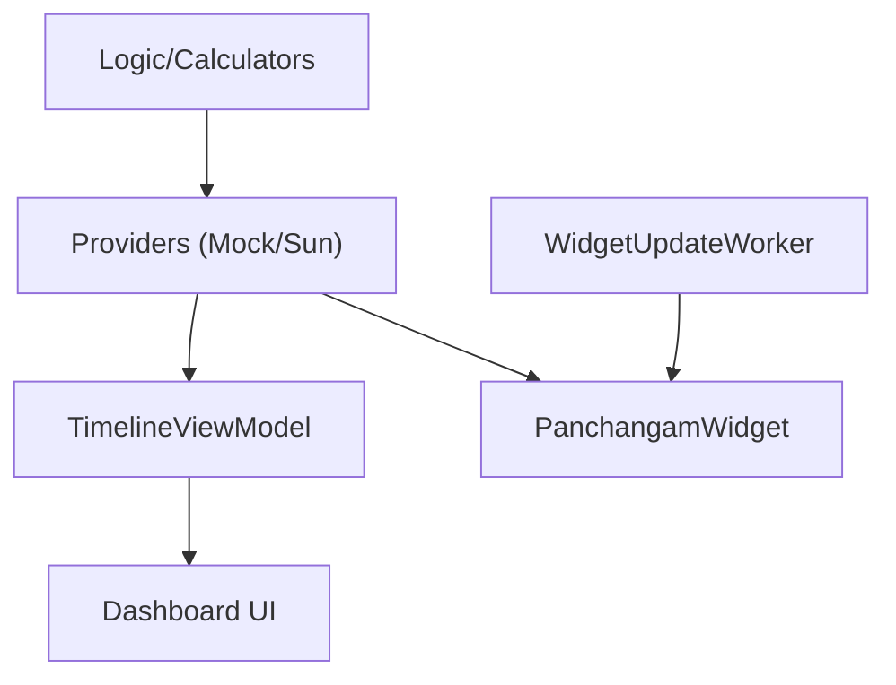

# Code Summary & Structural Map

## 1. Architecture & Data Flow
- **Pattern**: MVI-lite (StateFlow driven). Monolithic `:app` module.
- **Flow**: `Logic (Calculators)` -> `Providers` -> `ViewModel/Widget` -> `UI (Compose/Glance)`.

## 2. Layer Responsibilities

### `logic/` (Domain)
- `PanchangamCalculator`: Core engine (Nalla Neram, Gowri, Horai). Proportional/Fixed styles.
- `LagnaCalculator`: Sidereal ascendants & Maitra Muhurtham (IAU 1982/Meeus).
- `LunarCalendarUtils`: Ephemeris (ELP-2000), Lahiri Ayanamsha, ritual windows.
- `TamilCalendarUtils`: 60-year cycles, anchored festival detection (`RitualContext`).
- `SunriseSunsetProvider` & `MockPanchangamProvider`: Solar calculations & slot clipping/transitions.

### `ui/` & `widget/` (Presentation)
- `dashboard/`: 24h timeline. `TimelineCore` handles lane-scaling & harmony refinement.
- `navigation/`: State-driven Nav3 routing and custom `ViewMode` logic.
- `settings/`: DataStore-backed config (7 blocks), Custom Timeline management.
- `PanchangamWidget`: Glance-based M3 widget for at-a-glance timings.
- `theme/`: `SacredTimelineColors` (Dual-tone gold/sticker-look).

### `data/` & `worker/` (Infrastructure)
- `SettingsRepository`: SSOT for config & Custom Timeline presets.
- `CacheManager`: Atomic JSON storage for `DayData` (keyed by lat/lng/date).
- `WidgetUpdateWorker`: Background cache maintenance & transition-aware updates.
- `VerifiedHolidays`: Static TN Public Holidays & Muhurthams.

### `model/` (State & Resources)
- `Metadata`: Logic-to-Resource bridge (localized strings, traditional guidance).
- `DayData`: Primary 24h snapshot ( Muhurthams, Tithis, Festivals).
- `Serializers`: K-Serialization for Java Time types.

## 3. Core Algorithms

### Harmony Layout (`TimelineCore.kt`)
1. **Anchor**: Assign items to Lane Ranks (Gowri Left, Horai Right).
2. **Refine**: 8-pass iterative expansion into dead space; items meet at midpoints.
3. **Render**: "Best Segment" (max width/height) anchor for content to prevent clipping.

### Event Anchoring (`TamilCalendarUtils.kt`)
- **Ritual Windows**: Pradosha (Sunset -90m), Nishita (Midnight window).
- **Udaya Vyapini**: Festivals anchored to Sunrise state to prevent calendar duplication.

## 4. Symbol Index
| Symbol | Responsibility |
| :--- | :--- |
| `TimelineCore` | 24h grid with dynamic lane scaling and harmony gap-filling. |
| `RitualContext` | Anchor data (Sunrise, Pradosha, Nishita) for event detection. |
| `CacheManager` | Versioned atomic storage for timeline performance. |
| `Metadata` | Mapping between calculation results and localized traditional text. |
| `LagnaCalculator` | Math core for zodiac rise times and Maitra potency. |
| `WidgetUpdateWorker` | Transition-triggered background updates and cache refills. |
| `Custom Timeline` | Persistent user-defined column arrangements in `SettingsRepository`. |
