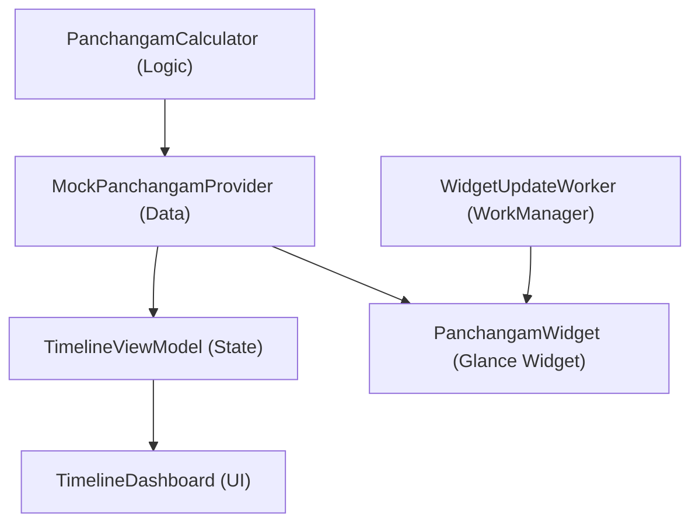

# Code Summary & Structural Map

Technical overview of the project architecture and data flow.

## 1. Module & Data Flow
- **:app**: Monolithic module containing all features.
- **Architecture**: MVI-lite (StateFlow driven UI).

## 2. Layer Responsibilities

### Domain/Logic (`logic/`)
- `PanchangamCalculator`: Core engine for Nalla Neram (sunrise-relative), Gowri Neram, and Horai. Supports both proportional (astronomical) and fixed (1.5h) timing styles.
- `MockPanchangamProvider`: Assembles 24h data by blending yesterday's night and today's day cycles.
- `SunriseSunsetProvider`: Local wrapper for solar calculations; calculates sunrise/sunset using the Meeus algorithm based on GPS coordinates. (Network dependency removed).
- `LunarCalendarUtils`: High-precision astronomical engine (**ELP-2000 / Meeus**) for Tithi, Nakshatra, and Paksha. Implements **Lahiri Ayanamsha** for sidereal accuracy.
- `TamilCalendarUtils`: Mapping for 60-year cycles and lunar-solar festival combinations.

### UI (`ui/`)
- `ui/dashboard`: 24h vertical timeline, `TimelineCore` (lane logic), and `SunTimesDisplay`. `TimelineViewModel` performs iterative interval-based festival detection.
- `ui/settings`: Hierarchical menus for general settings, Tithi/Nakshatra toggles, and Column management.
- `ui/theme`: `SacredTimelineColors` for dynamic tinting and sticker-look UI patterns.
- `ui/navigation`: Navigation 3 state definitions and `ViewMode` routes.

### Data (`data/`)
- `SettingsRepository`: Jetpack DataStore for user preferences (now including Theme and Lunar filters).
- `VerifiedHolidays`: Static dataset for 2024-2026 confirmed TN Public Holidays and Subha Muhurthams.
- `CacheManager`: Shared JSON caching for App/Widget offline support.

## 3. Infrastructure
- **Background**: `WorkManager` synchronized with time-slot transitions.
- **Localization**: `AppCompatDelegate` for dynamic English/Tamil switching.

## 4. Symbol Index
| Symbol | Responsibility |
| :--- | :--- |
| `PanchangamCalculator` | Math for all time slots (Gowri, Horai, Nalla Neram). |
| `MockPanchangamProvider` | Coordinates yesterday/today cycles to fill a 24h window. |
| `SunriseSunsetProvider` | Retrofit-based API client for location-specific solar data. |
| `MainActivity` | App lifecycle & Navigation 3 host. |
| `TimelineViewModel` | MVI state holder; manages location, date, and filtered data. |
| `SettingsRepository` | DataStore source of truth for all user preferences. |
| `PanchangamWidget` | Glance-based Home Screen summary widget. |
| `Metadata` | UI mapping for localized strings and spiritual icons. |
| `TimelineCore` | The heart of the UI; manages vertical 24h layout and lane distribution. |
| `TimingCard` | Multi-layered "sticker-look" card for individual time slots. |
| `DashboardDetail` | Unified model for significance data (header & timeline). |
| `DashboardDetailSheet` | Reactive BottomSheet for all spiritual guidance. |
| `FullDayEvent` | Model for sticky headings and background tinting. |
| `Muhurtham` | Specialized timing model for Brahma and Abhijit windows. |
