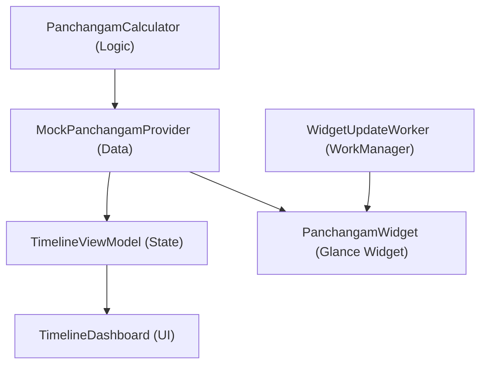

# Code Summary & Structural Map

Technical overview of the project architecture and data flow.

## 1. Module & Data Flow
- **:app**: Monolithic module containing all features.
- **Architecture**: MVI-lite (StateFlow driven UI).

## 2. Layer Responsibilities

### Domain/Logic (`logic/`)
- `PanchangamCalculator`: Core engine for Nalla Neram (sunrise-relative), Gowri Neram, and Hora.
- `LunarCalendarUtils`: Astronomical formulas for Tithi, Nakshatra, and Paksha; calculates exact start/end intervals for a 24h window.
- `TamilCalendarUtils`: Mapping for 60-year cycles and lunar-solar festival combinations.

### UI (`ui/`)
- `ui/dashboard`: 24h vertical timeline, `SunTimesDisplay` (Marquee header with PNG spiritual icons).
- `ui/settings`: Hierarchical menus for general settings, Tithi/Nakshatra toggles, and Theme management.

### Data (`data/`)
- `SettingsRepository`: Jetpack DataStore for user preferences (now including Theme and Lunar filters).
- `VerifiedHolidays`: Static dataset for 2024-2026 confirmed TN Public Holidays and Subha Muhurthams.
- `CacheManager`: Shared JSON caching for App/Widget offline support.

## 3. Infrastructure
- **Background**: `WorkManager` synchronized with time-slot transitions.
- **Localization**: `AppCompatDelegate` for dynamic English/Tamil switching.

## 4. Symbol Index
| Class | Responsibility |
| :--- | :--- |
| `PanchangamCalculator` | Math for all time slots. |
| `MainActivity` | App lifecycle & Navigation host. |
| `SettingsRepository` | Source of truth for preferences. |
| `PanchangamWidget` | Glance-based Home Screen summary. |
| `Metadata` | UI mapping for localized strings/icons. |
