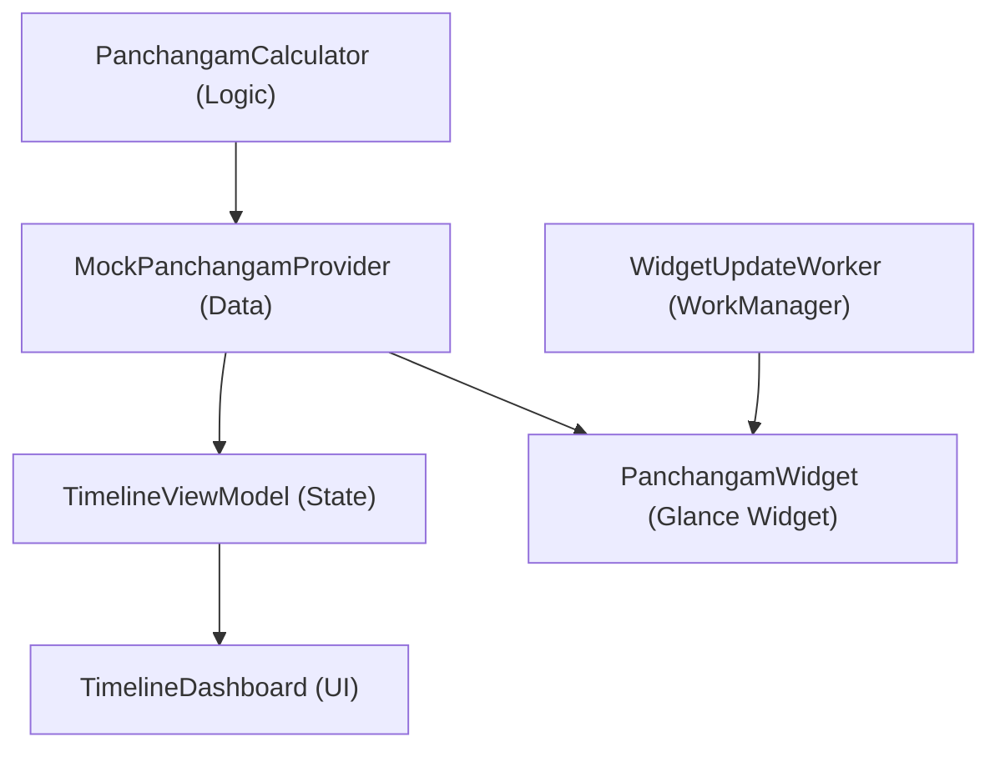

# Code Summary

This document provides an overview of the core logic and architecture of the Sacred Timeline project.

## Architecture Overview

## Core Logic: Panchangam Calculation

The `PanchangamCalculator` (`com.suresh.sacredtimeline.logic`) is the engine of the application. It computes various auspicious and inauspicious time windows:

- **Nalla Neram**: Fixed windows of "Good Time" that shift based on the day's sunrise.
- **Gowri Neram**: Divided into 8 equal slots for day and 8 for night, following specific planetary sequences (Amridha, Uthi, Labam, etc.) based on the day of the week.
- **Hora**: Planetary hours, dividing day and night into 12 slots each. The sequence starts with the planet associated with the day of the week.

### Key Models
- `Timing`: Base class for all time-based events.
- `Auspiciousness`: Enum representing the quality of time (GREEN, BLUE, AMBER, RED).

## UI Structure: Jetpack Compose

The app uses a modern Compose-first architecture:

- **Navigation 3**: Implementation uses `androidx.navigation3`. Navigation state is managed via a `backStack` in `MainActivity`.
- **TimelineDashboard**: The central screen of the app.
    - **HorizontalDateDial**: A scrolling list of dates for quick navigation.
    - **TimelineContent**: A vertically scrollable 24-hour grid.
    - **TimingCard**: Visual representation of a timing slot, featuring high-contrast double borders and a dynamic text-contrast engine.
- **Theme**: Material 3 theme (`SacredTimelineTheme`) using a centralized color mapping engine (`SacredTimelineColors`) for screenshot-accurate palette consistency.

## Home Screen Widget: Glance

The `PanchangamWidget` (`com.suresh.sacredtimeline.widget`) is built using **Jetpack Glance**. It provides a real-time summary of the current Nalla Neram, Gowri Neram, and Hora status.

- **Updates**: Managed by `WidgetUpdateWorker` using `WorkManager`, synchronizing refreshes precisely with time-slot transitions.
- **Layout**: Simplified 3-column architecture (Neram, Gowri, Hora) with a transparent background and app-launch action.
