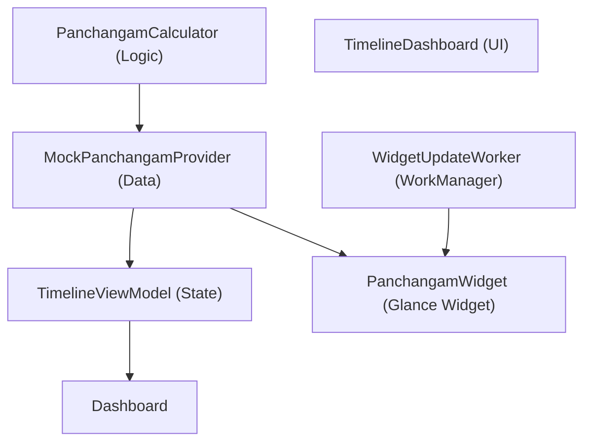

# Code Summary & Structural Map

Technical overview of the project architecture and data flow.

## 1. Module & Data Flow
- **:app**: Monolithic module containing all features.
- **Architecture**: MVI-lite (StateFlow driven UI).

## 2. Layer Responsibilities

### Domain/Logic (`logic/`)
- `PanchangamCalculator`: Core engine for Nalla Neram, Gowri, and Horai. Supports both proportional and fixed styles.
- `LagnaCalculator`: Identifies zodiac rise times using IAU 1982/Meeus for Maitra Muhurtham detection.
- `LunarCalendarUtils`: High-precision astronomical engine (**ELP-2000 / Meeus**). Implements shared **Lahiri Ayanamsha**.
- `TamilCalendarUtils`: Mapping for 60-year cycles and lunar-solar festival combinations.

### UI (`ui/`)
- `ui/dashboard`: 24h vertical timeline. `TimelineCore` implements a **transitive clustering** layout model with an **8-pass iterative harmony refiner** for gap-filling.
- `ui/settings`: Reorganized into 7 logical blocks. Manages persistent **Custom Timeline** configurations and two-way menu sync.
- `ui/theme`: `SacredTimelineColors` for dynamic dual-tone gold and sticker-look patterns.

### Data (`data/`)
- `SettingsRepository`: DataStore source of truth. Includes a dedicated **Sandbox Slot** for saving user's manual column selections and orders.
- `VerifiedHolidays`: Static dataset for confirmed TN Public Holidays and Subha Muhurthams.

## 3. Key Algorithms

### "Harmony" Layout Engine (`TimelineCore.kt`)
1. **Pass 1 (Anchor)**: Assign items to logical "Lane Ranks" based on category (Gowri Left, Horai Right).
2. **Pass 2-9 (Co-operative Refinement)**: Iteratively expand boxes halfway into available dead space. Items meet at midpoints, ensuring symmetrical distribution.
3. **Pass 10 (Render)**: Identify the **Best Segment** (widest + tallest) within a box to anchor content, preventing clipping in stepped shapes.

## 4. Symbol Index
| Symbol | Responsibility |
| :--- | :--- |
| `TimelineCore` | Vertical 24h grid with dynamic lane scaling and gap-filling. |
| `TimingCard` | Adaptive "Sticker" card with top-centered headings and best-segment text placement. |
| `RitualContext` | Centralized data structure for anchored events (Sunrise, Pradosha, and Nishita windows). |
| `Custom Timeline` | A persistent ViewMode that remembers a user's unique column arrangement. |
| `SettingsRepository` | Manages both active settings and saved "Custom" presets. |
| `LagnaCalculator` | Mathematical core for sidereal ascendants and Maitra Muhurtham. |
| `Tamil Date Anchor` | Calendar-style UI widget providing a date reference in the timeline header. |
